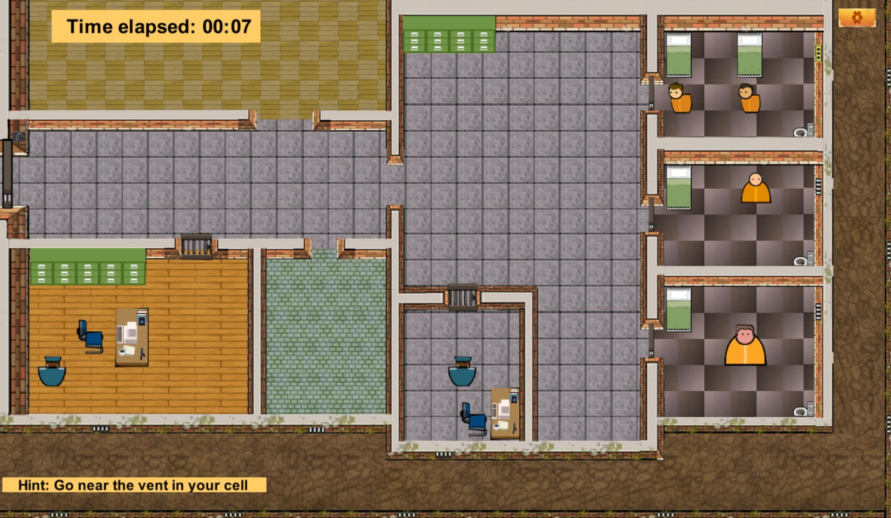

# Prison Break

Prison Break is a 2D multiplayer game developed in Greenfoot using Java. The objective of the game is to escape from prison while overcoming various challenges.

## 🕹️ How to Play
To play the game, follow these steps:

- **Download & Install Greenfoot** – You can download it from the official website.
- **Clone or Download this Repository** – Get the project files from this repository.
- **Open the Project in Greenfoot** – Launch Greenfoot and open the downloaded files.

## Controls
Use the following controls to play:

  

## 🎮 Game Preview
Here’s a glimpse of the game:

<h3 align="center"> Main Menu </h3>

   

<h3 align="center"> Gameplay </h3>

  

